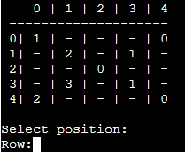

# Minesweeper
## Purpose Of The Project
The purpose of the project was to showcase the use and functionality that python has to offer. Python can be used to build programs, and websites, automate a task, and conduct data analysis. I have created the minesweeper game to show some of the Python functions. The biggest function I relied on was data collection and analysis to ensure my functions work, such as saving coordinates that the user has picked so the user's choices show up on the game board. 

Minesweeper is a rather logical puzzle, where the purpose is to uncover the whole minefield without hitting any mines and the only way to avoid mines is by using the numbers that the board shows as clues to how many hidden mines are around the number. 

## User Stories
### 1) Main Menu/choices
- As a user, I want to know how to play the game.
- As a user, I want to be able to pick the difficulty of the game.
- As a user, I want to be able to know how easy/hard is the difficulty.
- As a user, I want the navigation and choices to be easy and clear to follow.

### 2) Game
- As a user, I want to be able to clearly see the board.
- As a user, I want the board to be labelled so I know what to do.
- As a user, I want to clearly see if I won or lost.

## Features
### The game has 4 sections
#### 1. Main-menu
- The Main Menu is the first section that the user will be greeted with, along with a `pyfiglet` logo. In this section, the user can choose between rules or difficulty selection.
 
- If the user enters 1 he will be taken to the rules and if 2 then difficulty.

#### 2.Rules
- The rules section is simple and contains a paragraph about how to play minesweeper. Style has been added to the rules, when the user enters the section then the rules will first type themself out. The style was achieved with `import sys, time`.
```python
    def typewriter(rules):
        for char in rules:
            sys.stdout.write(char) | run.py line 58
            sys.stdout.flush()
            time.sleep(0.02)

    print(typewriter(rules))
```


- Under the rules, there's a message for the user to enter 'BACK', entering the right input will take him to a difficulty selection.

#### 3. Difficulty selection
- The difficulty selection has a choice of 4 choices, Easy mode which will print out a 5x5 board with 4 mines, Medium mode with an 8x8 board and 10 mines, Hard mode with a 10x10 board and 25 mines and lastly a choice to go back to main-menu.

 

#### 4. Game board
- Once the difficulty is selected the game will draw a board corresponding to the difficulty selected. The board has numbers on the left and top so that the user will be able to easily navigate to what coordinates they want to choose. 

  

- Under the board is another input space for the user to input the row and the column he wants to choose. 


- After the user selects coordinates, the corresponding position will open and show a number, 0 means there are no mines near and 1+ means how many mines are near that number. When the position is selected the coordinates get saved for later use.



- The user plays until he opens all positions apart from mines which means he won. If the user hits a mine, it is a game over, this will show the whole board and all the positions including where the mines are.
- The mines have been made red for easier reading against all the other numbers.

 

- After either win or loss, the user is prompted with another input, this input will either quit the game or it will take the user back to the main menu.

## Future Features
Future features that I would like to add to the game are as follows:
 - A timer to measure how quickly the user has completed the game, brings competitiveness.
 - Flags that can be put in the position of where the user thinks a mine might be, this is so that they are aware of it more and don't risk forgetting about that spot.
 - When the user picks a position, every position that equals 0 will open as well until they hit a number on all sides. 

## Wireframes And Further Planning
### Wireframes
I've done a [Wireframes](./doc/wireframe.PNG) that represents different scenarios in the command line just so I can visualise the project. The outcome was as expected so the final project is just like the original wireframe.

### Flowchart 
I've also created a [Flowchart](./doc/flowchart.PNG) to plan all the scenarios that should that place with every process/function and with every choice the user takes. The final project follows this chart very well.

## Testing
### Code
I have tested the code by using [PEP8 online check](http://pep8online.com/). Both `run.py` and `board.py` files came back with no issues.

### Project testing
- I had to test every input ensuring that if the user inputs incorrect input it will come back with some sort of error to let them know and let them enter a correct value.
- For inputs that required numbers, e.g. main menu rules or difficulty selection required either 1 or 2. To ensure only those are the correct inputs that will respond I have used the `import pyinputplus` module which allowed me to make sure the correct inputs are 1 and 2 by setting min and max arguments. If not error is thrown and asks the user to enter again.

```python
choice = pyip.inputInt("""Enter 1 for Rules or2 for Difficulty: """, min=1, max=2) | run.py line 24
```

  

- Another input that had to be checked for correct input was the coordinates, this was done by using the `import pyinputplus` module again, however, I also had to make sure the user cant use the same coordinates twice. Every input was saved and compared to input, if the input was the same as the saved coordinates an error was thrown.


- I changed boards for a lot of testing so that I am able to see where mines are and made the boards smaller for quicker tests. These tests were done in the Gitpod Terminal.

```python
display_board(player_map) ===> display_board(minesweeper_map) | run.py line 124
```


- Testing this way enabled me to see if the board if responding to input, to the win and loss statements.

## Fixed Bugs
- Co-ordinates didn't save and taken positions counter did not increment, this was a silly mistake made by me. I put in the empty list in a while loop meaning every time code was executed it reset to being empty. The same happened with the counter, which was set to 0 and every time started, moved the variables outside the loops.
- Numbers that show if mine is next to them didn't show next to every mine as the code didn't iterate through every mine on the board due to the wrong indentation.

## Unfixed Bugs
- Mines do have a set number that is supposed to randomly deploy depending on difficulty, however, sometimes the set number doesn't deploy. Left as that because it does not affect the game and usually misses out just one mine. 

## Technologies 
- Module imports 
    - sys and time were imported to create animation for the rules section.
    - pyfiglet was used to create a logo to welcome the user to minesweeper
    - pyinputplus was used to help ensure user inputs correct input
    - termcolor was used to change the colour of the mines to red so its easier to differentiate 

- Code
    - The code used was Python 

## Deployment
- Heroku - Project was deployed using Code Institutes terminal template
    - Create new app
    - Set 
        - App name
        - Region
    - Press create new app
    - Settings
        - Add config vars
            - Key = PORT
            - Value = 8000
    - Add buildpack
        - Python
        - Nodejs
    - Deploy

Link to [HerokuApp Minesweeper Project](https://minesweeper-milestone-project.herokuapp.com/)
        
- Gitpod
    - Terminal
    - python3 run.py
    - Deploys code in terminal

## Credits
- [Leonardo Yeo](https://medium.com/@leonardyeo-xl) blog for minesweeper creation, code implementation for function incrementing numbers around mines.
- [Tech With Tim](https://www.youtube.com/c/TechWithTim) python tutorials.
- [Kylie Ying](https://www.youtube.com/c/YCubed) logic explanation and visualisation of what the code should look like for such a game.
- Ed Bradley tutor from Code institute. Helped me come up with a solution + discussed how a future feature could be done and the logic behind it.
- Code institute for the deployment terminal.